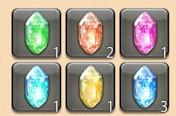
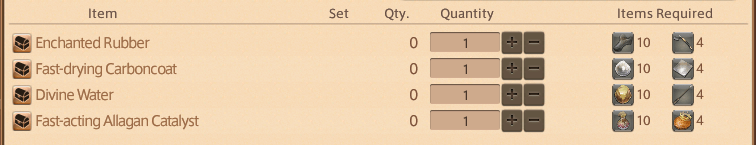
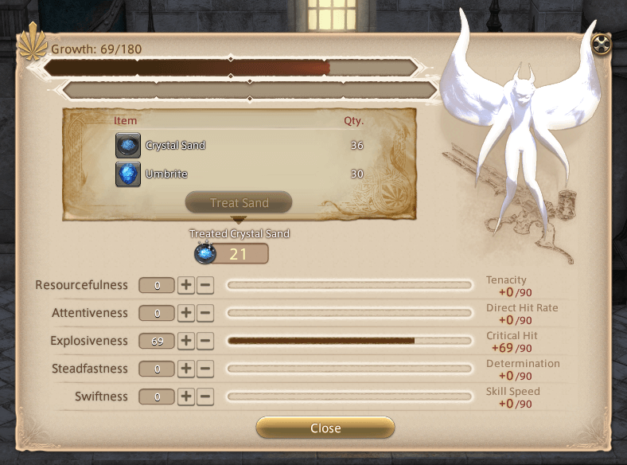
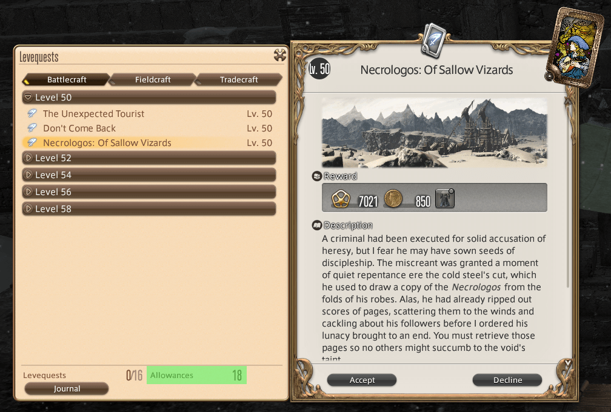
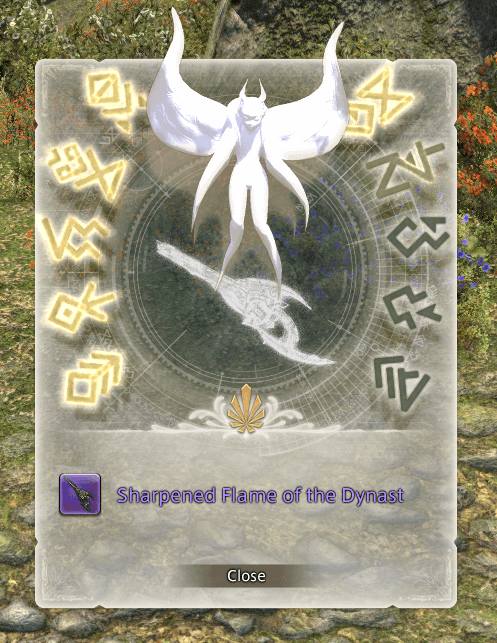

# Anima Weapons

!!! bug "Personal Note — To Do"
    - [ ] Add introduction paragraph.
    - [ ] Confirm steps to all stages by completing another Anima weapon.
    - [ ] Confirm coordinates for all NPCs.
    - [ ] Add links to dungeon and trial pages.

## General Information

- Due to its obsolete stats, I would recommend reaching maximum level to have an easier time grinding out this quest chain.
- You can work on multiple Heavensward relic weapons at the same time, so long you are on different stages for each weapon.

!!! example "Personal Experience"
    In comparison to A Realm Reborn's Zodiac weapons, the Heavensward's Anima weapons heavily depend on acquiring items purchased with Grand Company Seals and Poetics. If you pre-purchase and stockpile all these required items, you can finish this quest line in a couple days.

## Stages

1. [Animated](#1-animated)
2. [Awoken](#2-awoken)
3. [Anima](#3-anima)
4. [Hyperconductive](#4-hyperconductive)
5. [Reconditioned](#5-reconditioned)
6. [Sharp](#6-sharp)
7. [Complete](#7-complete)
8. [Lux](#8-lux)

## Prerequisites

- Completed Main Scenario Quest: [Heavensward](https://na.finalfantasyxiv.com/lodestone/playguide/db/quest/29fa56153f5/)
- Reach level 60 for your chosen job of: Paladin, Warrior, Monk, Dragoon, Bard, Ninja, Black Mage, Summoner, White Mage,  Scholar, Machinist, Astrologian, or Dark Knight.
    - Any unlisted jobs here cannot obtain a Heavensward relic weapon.
- Reached Second Lieutenant rank for your chosen Grand Company (i.e. Maelstrom, Immortal Flames, Twin Adder).

## Total Cost

!!! note ""
    - Some items will not be available to purchase at Merchant NPCs until you have reached certain stages.
    - Optional items can be acquired by other methods. However, using Grand Company Seals or Poetics to obtain these items requires the least amount of overall thought and effort.

- Some gil:
    - For teleport fees.
    - *(Optional; If you cannot craft)* For purchasing crafted items from the Market Board.
- *(Optional)* 140,000 Grand Company Seals
    - *(Optional)* 20,000 for Adamantite Francesca (20,000 each x4)
    - *(Optional)* 20,000 for Dispelling Arrow (20,000 each x4)
    - *(Optional)* 20,000 for Kingcake (20,000 each x4)
    - *(Optional)* 20,000 for Titanium Alloy Mirror (20,000 each x4)
    - *(Optional)* 60,000 for Pneumite (4,000 each x15)
- 5,000—17,250 Allagan Tomestones of Poetics
    - *(Optional)* 1,500 for Unidentifiable Bone (150 each x10)
    - *(Optional)* 1,500 for Unidentifiable Ore (150 each x10)
    - *(Optional)* 1,500 for Unidentifiable Seeds (150 each x10)
    - *(Optional)* 1,500 for Unidentifiable Shell (150 each x10)
    - *(Optional)* 1,750 for Aether Oil (350 each x5)
    - 4,500—6,000 for Umbrites (75 each x60—80)
    - *(Optional)* 2,000 for Singing Clusters (40 each x50)
    - *(Optional)* 1,500 for Penumite (100 each x15)
    - 500 for Archaic Enchanted Ink (x1)

## 1. Animated

### An Unexpected Proposal

1. Speak with to [Rowena](https://na.finalfantasyxiv.com/lodestone/playguide/db/npc/npc/e10f7eee1b8/) (Idyllshire, `X:5.7, Y:5.5`) to pick up the quest: [An Unexpected Proposal](https://na.finalfantasyxiv.com/lodestone/playguide/db/quest/fb5d98ff180/)
    - You will only have to do this once per character.
    - Your next relic weapons will start from [Soul without Life](#soul-without-life) step.
2. Speak with Ardashir (Azys Lla, `X:7.4, Y:11.5`).

### Soul without Life

1. Speak to [Ardashir](https://na.finalfantasyxiv.com/lodestone/playguide/db/npc/npc/08cc9e30841/) (Azys Lla, `X:7.4, Y:11.5`) to pick up the quest: [Soul without Life](https://na.finalfantasyxiv.com/lodestone/playguide/db/quest/0136a6df60a/)
2. Speak with Rowena (Mor Dhona, `X:21.9, Y:4.9`).
3. Speak with [Syndony](https://na.finalfantasyxiv.com/lodestone/playguide/db/shop/0e148938969/) (Mor Dhona, `X:22.6, Y:5.8`) upstairs on the balcony. 
    - She will provide the required Astral Nodule (x1) and Umbral Nodule (x1) from one of the following methods:
        1. Trade in a Zodiac Zeta relic weapon to receive both Nodules. This is the final stage of an A Realm Reborn relic weapon.
        2. Trade in one Luminous Crystal of each type (x6) from successfully completing FATEs in specific zones.
4. Report back to Ardashir.
5. Congratulations! You have completed this stage. 

!!! danger "Option 1: Trade in Zodiac Zeta relic weapon"
    This will destroy your A Realm Reborn relic weapon! 
    
    If you decide to trade in your Zodiac Zeta weapon, ensure that you have finished [The Vital Title](https://na.finalfantasyxiv.com/lodestone/playguide/db/quest/edcdb18b80f/) quest from Jalzahn (North Shroud, `X:29.5, Y:19.6`). Completing this quest allows you purchase replicas of your A Ream Reborn relic weapon from Drake (North Shroud, `X:30.3, Y:20.1`). 
    
    If you did not complete this quest before trading in your Zodiac Zeta weapon, you are out of luck and will only be able to get back the initial step of the relic ([Zenith](/relics/zodiac-weapons/#2-zenith)) from a Calamity Salvager NPC located in the main cities:
    
    - [Old Gridania](https://na.finalfantasyxiv.com/lodestone/playguide/db/shop/350cd619ffd/) (`X:10, Y:8.4`)
    - [Limsa Lominsa Upper Decks](https://na.finalfantasyxiv.com/lodestone/playguide/db/shop/9d03aec955c/) (`X:11.3, Y:14.3`)
    - [Ul'dah](https://na.finalfantasyxiv.com/lodestone/playguide/db/shop/67872c11c61/) (`X:12.6, Y:13.1`) 

!!! info "Option 2: Collecting Luminous Crystals"
    - To receive any Luminous Crystals from FATEs, you must have in your quest Journal: [Soul without Life](https://na.finalfantasyxiv.com/lodestone/playguide/db/quest/0136a6df60a/)
    - Any FATE in the specified zone can drop Luminous Crystals, but it must be successfully completed.
    - Luminous Crystals are not a guaranteed drop. You can get one from the first FATE you do in a zone, or it can be from the 20th FATE.
    - You can complete FATEs as any job.

    | Zone                       | Luminous Crystal |
    | :------------------------- | :--------------- |
    | The Sea of Clouds          | Wind             |
    | Azys Lla                   | Fire             |
    | The Churning Mists         | Lightning        |
    | Coerthas Western Highlands | Ice              |
    | Dravanian Forelands        | Earth            |
    | Dravanian Hinterlands      | Water            |

    

    !!! tip
        - When you receive a Luminous Crystal, there will be an in-game popup notification. You can't miss it!
        - Luminous Crystals will go into your inventory. Ensure that you have enough free inventory space!
        - You only need one type of Luminous Crystal per relic weapon.
        - This is a a good opportunity to train your Chocobo companion in combat.

    !!! example "Personal Experience"
        It took me less than one hour to collect all Luminous Crystals.

## 2. Awoken

### Toughening Up

!!! note 
    - You can complete dungeons unsynced in an Unrestricted Party.

1. Speak with Ardashir with your relic weapon equipped to pick up the quest: [Toughening Up](https://na.finalfantasyxiv.com/lodestone/playguide/db/quest/3a19d47a205/)
2. Complete 10 dungeons:
    1. Snowcloak
    2. Sastasha (Hard)
    3. The Sunken Temple of Qarn (Hard)
    4. Keeper of the Lake
    5. Wanderer's Palace (Hard)
    6. Amdapor Keep (Hard)
    7. Dusk Vigil
    8. Sohm Al
    9. The Aery
    10. The Vault
6. Report back to Ardashir (Azys Lla, `X:7.4, Y:11.5`) with your relic weapon equipped.
7. Congratulations! You have completed this stage. 

## 3. Anima

!!! summary "Cost"
    - *(Optional)* 80,000 Grand Company Seals for:
        - 20,000 for Adamantite Francesca (20,000 each x4)
        - 20,000 for Dispelling Arrow (20,000 each x4)
        - 20,000 for Kingcake (20,000 each x4)
        - 20,000 for Titanium Alloy Mirror (20,000 each x4)
    - *(Optional)* 6,000 Allagan Tomestones of Poetics for:
        - 1,500 for Unidentifiable Bone (150 each x10)
        - 1,500 for Unidentifiable Ore (150 each x10)
        - 1,500 for Unidentifiable Seeds (150 each x10)
        - 1,500 for Unidentifiable Shell (150 each x10)

### Coming Into Its Own

1. Speak with Ardashir to pick up the quest: [Coming into Its Own](https://na.finalfantasyxiv.com/lodestone/playguide/db/quest/a37d18ed018/)
2. Speak with Cristiana (Mor Dhona, `X:21.3, Y:5.4`).
    - Trade items with Cristiana for the required `Anima Weapon Materials`.
4. Deliver the materials to Gerolt (Azys Lla, `X:7.4, Y:11.5`) with your relic weapon unequipped.
5. Congratulations! You have completed this stage. 

!!! info "Anima Weapon Materials"
    - Both required items can be obtained from multiple sources

    

    | Anima Material                    | Required Item 1            | Required Item 2            |
    | :-------------------------------- | :------------------------- | :------------------------- |
    | Enchanted Rubber (x1)             | Unidentifiable Bone (x10)  | Adamantite Francesca (x4)  |
    | Fast-drying Carboncoat (x1)       | Unidentifiable Shell (x10) | Titanium Alloy Mirror (x4) |
    | Fast-acting Allagan Catalyst (x1) | Unidentifiable Seeds (x10) | Kingcake (x4)              |
    | Divine Water (x1)                 | Unidentifiable Ore (x10)   | Dispelling Arrow (x4)      |

    ??? info "Required Item 1"
        - Purchase with Poetics:
            - Sold by [Auriana](https://na.finalfantasyxiv.com/lodestone/playguide/db/shop/27773b8b4a7/) (Mor Dhona, `X:22.7, Y:6.6`) > `Special Arms` > `Others`
            - Sold by [Hismena](https://na.finalfantasyxiv.com/lodestone/playguide/db/shop/02b3c29bf1c/) (Idyllshire, `X:5.7, Y:5.2`) > `Special Arms` > `Others`
            - Sold by Rowena's Representatives in main cities > `Combat Supplies` > `Special Arms Materials`
        - Purchased with Beast Tribe tokens which earned from completing daily quests from specified Beast Tribes.
        - Alexander Gordias ("... of the Father") raid drops
            - Trade with [Sabina](https://na.finalfantasyxiv.com/lodestone/playguide/db/shop/9e725a25004/) (Idyllshire, `X:5.7, Y:5.3`) > `Purchase Gordian Items` > `Precision Gordian Parts Exchange`
        - Purchased with Allied Seals from your chosen Grand Company's Hunt Billmaster > `Allied Seals (Other)`
        - Treasure Maps are from level 60 gathering nodes and fishing holes.

        | Required Item        | Poetics | Beast Tribe Tokens                                           | Alexander Gordias             | Allied Seals | Treasure Maps           |
        | :------------------- | :------ | :----------------------------------------------------------- | :---------------------------- | :----------- | ----------------------- |
        | Unidentifiable Bone  | 150     | Amalj'aa (x3) Vanu Vanu (x6) Vath (x6) Moogle (x18) | Precision Gordian Bolt (x3)   | 300          | -                       |
        | Unidentifiable Ore   | 150     | Kobold (x3) Vanu Vanu (x6) Vath (x6) Moogle (x18)   | Precision Gordian Spring (x3) | -            | Timeworn Dragonskin Map |
        | Unidentifiable Seed  | 150     | Sylph (x3) Vanu Vanu (x6) Vath (x6) Moogle (x18)    | Precision Gordian Shaft (x3)  | 300          | -                       |
        | Unidentifiable Shell | 150     | Sahagin (x3) Vanu Vanu (x6) Vath (x6) Moogle (x18)  | Precision Gordian Lens (x3)   | -            | Timeworn Wyvernskin Map |

    ??? info "Required Item 2"
        - Can be purchased from your Grand Company's Quartermaster for 5,000 Grand Company Seals each for a total of 80,000 Grand Company Seals.
        - Can be crafted.
        - Can be purchased from the Market Board for gil.

        | Required Item 2       | Crafter | Materials                                                                                                               |
        | :-------------------- | :------ | :---------------------------------------------------------------------------------------------------------------------- |
        | Adamantite Francesca  | BSM     | Adamantite Nugget (x1) Birch Lumber (x1) Pterodactyl Strap (x1)                                                   |
        | Dispelling Arrow      | CRP     | Blessed Fletchings (x1) Hallowed Chestnut Lumber (x1) Hardsilver Nugget (x1)                                      |
        | Kingscake             | CUL     | Birch Syrup (x1) Highland Flour (x1) Moogle Minature (x1) Okeanis Egg (x1) Tiny Crown (x1) Yak Milk (x1) |
        | Titanium Allow Mirror | ALC     | Hardsilver Sand (x1) Holy Water (x1) Titanium Alloy Square (x1) Vitriol (x1)                                   |

## 4. Hyperconductive

!!! summary "Cost"
    - *(Optional)* 1,750 Allagan Tomestones of Poetics for Aether Oil (350 each x5)

### Finding Your Voice

1. Speak with Ardashir to pick up the quest: [Finding Your Voice](https://na.finalfantasyxiv.com/lodestone/playguide/db/quest/bf6394ecf52/)
2. Obtain Aether Oil (x5).
    1. From a repeatable quest: [The Gift of the Archmagus](https://na.finalfantasyxiv.com/lodestone/playguide/db/quest/810119f8166/) from [Koh Rabntah](https://na.finalfantasyxiv.com/lodestone/playguide/db/npc/npc/8eb0d83c09b/) (Mor Dhona, `X:21.8, Y:8.1`). However, this is the least efficient method because it requires you to run each of the three Crystal Tower alliance raids (Labyrinth of the Ancients, Syrcus Tower, and The World of Darkness) per Aether Oil. So 1 Aether Oil x 3 alliance raids = 15 total alliance raid runs.
    2. Purchase with 1,750 Poetics.
        - Sold by [Auriana](https://na.finalfantasyxiv.com/lodestone/playguide/db/shop/27773b8b4a7/) (Mor Dhona, `X:22.7, Y:6.6`) > `Special Arms` > `Others`
        - Sold by [Hismena](https://na.finalfantasyxiv.com/lodestone/playguide/db/shop/02b3c29bf1c/) (Idyllshire, `X:5.7, Y:5.2`) > `Special Arms` > `Others`
        - Sold by Rowena's Representatives in main cities > `Combat Supplies` > `Special Arms Materials`
3. Report back to Ardashir.
4. Congratulations! You have completed this stage. 

## 5. Reconditioned

!!! summary "Cost"
    - 4,500—6,000 Allagan Tomestones of Poetics for Umbrites (75 each x60—80)

### A Dream Fulfilled

1. Speak with Ardashir to pick up the quest [A Dream Fulfilled](https://na.finalfantasyxiv.com/lodestone/playguide/db/quest/1ef99ba9eeb/)
2. Speak with [Ulan](https://na.finalfantasyxiv.com/lodestone/playguide/db/npc/npc/0b160350e8f/) (Idyllshire, `X:6.4, Y:4.7`).
3. Obtain Umbrite and Crystal Sands.
    - You will need 60—80 Umbrites depending on your luck.
    - You will need 60—80 Crystal Sands depending on your luck.
4. Speak with Ulan to `foster the anima's growth`.
    - Equip your relic weapon.
    - `Treat Sand` to convert your Crystal Sands and Umbrites.
    - Add points to attributes until you reach a total of 240 points.
5. Report back to Ardashir with your relic weapon unequipped.
6. Congratulations! You have completed this stage. 

!!! info "Umbrites"
    - Purchase with Poetics.
    - Sold by [Auriana](https://na.finalfantasyxiv.com/lodestone/playguide/db/shop/27773b8b4a7/) (Mor Dhona, `X:22.7, Y:6.6`) > `Special Arms` > `Others`
    - Sold by [Hismena](https://na.finalfantasyxiv.com/lodestone/playguide/db/shop/02b3c29bf1c/) (Idyllshire, `X:5.7, Y:5.2`) > `Special Arms` > `Others`
    - Sold by Rowena's Representatives in main cities > `Combat Supplies` > `Special Arms Materials`

!!! info "Crystal Sands"
    - Obtained by trading items to Ulan.
    - Each trade will grant 2 Crystal Sands.
    - Recommended options:
        - Blue Crafters' Scrip Tokens (x5) — from 125 White Crafters' Scrips (25 each x5)
        - Blue Gatherers' Scrip Token (x5) — from 125 White Gathers' Scrips (25 each x5)
        - Amber-encased Vilekin (x1) — from Heavensward levequests
        - Moonstones (x5) — 20,000 Grand Company seals (4,000 each x5)
        - Primal Pieces I — from Primal drops or purchase from Market Board
            - Inferno Horn (x1) — Ifrit (Extreme)
            - Crag Heart (x1) — Titan (Extreme)
            - Diamond Tear (x1) — Shiva (Extreme)
        - Primal Pieces II — from Primal drops or purchase from Market Board
            - Vortex Feather (x1) — Garuda (Extreme)
            - Barb of the Whorl (x1) — Leviathan (Extreme)
            - Large Levin Orb (x1) — Ramuh (Extreme)
        - Other Items — 225 Poetics
            - Superior Enchanted Ink (x5) — 125 Poetics (25 each x 5)
            - Thavnairian Mist (x5) — 100 Poetics (20 each x5)

    !!! tip
        - Refer to Ulan's Note for trades in your `Key Items` inventory.
        - You can use the Anima Glass to determine your progress in your `Key Items` inventory.

        

    !!! example "Personal Experience"
        - You can farm for Amber-encased Vilekin by spamming one levequest up to your leve allowance. 
        - Leve allowances stack up to 100 maximum and recharges 3 allowances every 12 hours real time.

        1. Speak with Elion (The Foundation, `X:10.1, Y:10.3`) > `Battlecraft Leves` > `Level 50` > `Necrologos: Of Sallow Vizards`
        2. Travel to Falcon's Nest to the levequest location.
        3. Initiate the levequest, but do not complete the objective!
        4. Your goal here is to find Treasure Coffers in the general vicinity of the levequest.
            - If you find it, great! You are rewarded Amber-encased Vilekin (x1).
            - If don't find it, then tough luck!
        5. Open your quest Journal > `Abandon` the levequest > `Retry` > `Initiate`
        6. Repeat until you have used up all your levequest allowance.

        

        It took me about one hour to gather 30 Amber-encased Vilekins using up 100 levequest allowances. Of course, this will depend on your luck with Treasure Coffer spawns.

## 6. Sharp

!!! summary "Cost"
    - 2,000 Allagan Tomestones of Poetics for Singing Clusters (40 each x50)

### Future Proof

1. Speak with Ardashir to pick up the quest: [Future Proof](https://na.finalfantasyxiv.com/lodestone/playguide/db/quest/855114f5906/)
2. Speak with Blamprest (Idyllshire, `X:7.9, Y:6`).
3. Obtain Singing Clusters (x50).
    - From a repeatable quests: 
        - Daily — [Cut from a Different Cloth](https://na.finalfantasyxiv.com/lodestone/playguide/db/quest/d5e9310f06b/) from [Angelet](https://na.finalfantasyxiv.com/lodestone/playguide/db/npc/npc/5fd17d357a2/) (Idyllshire, `X:7.9, Y:5.8`)
        - Weekly — [Seeking Inspiration](https://na.finalfantasyxiv.com/lodestone/playguide/db/quest/3e8fe25633a/) from [Amphelice](https://na.finalfantasyxiv.com/lodestone/playguide/db/npc/npc/868ad0c529e/) (Idyllshire, `X:7.9, Y:5.8`)
    - Purchase with 2,000 Allagan Tomestones of Poetics.
        - Sold by [Auriana](https://na.finalfantasyxiv.com/lodestone/playguide/db/shop/27773b8b4a7/) (Mor Dhona, `X:22.7, Y:6.6`) > `Special Arms` > `Others`
        - Sold by [Hismena](https://na.finalfantasyxiv.com/lodestone/playguide/db/shop/02b3c29bf1c/) (Idyllshire, `X:5.7, Y:5.2`) > `Special Arms` > `Others`
        - Sold by Rowena's Representatives in main cities > `Combat Supplies` > `Special Arms Materials`
4. Report back to Balmprest.
5. Report back to Ardashir with your relic weapon unequipped.
6. Congratulations! You have completed this stage. 

!!! info "Repeatable quests"
    - Daily — [Cut from a Different Cloth](https://na.finalfantasyxiv.com/lodestone/playguide/db/quest/d5e9310f06b/) from [Angelet](https://na.finalfantasyxiv.com/lodestone/playguide/db/npc/npc/5fd17d357a2/) (Idyllshire, `X:7.9, Y:5.8`)
        - Requires completing a Duty Roulette: Level 50/60/70/80/... dungeon.
        - Rewards Singing Cluster (x1).
    - Weekly — [Seeking Inspiration](https://na.finalfantasyxiv.com/lodestone/playguide/db/quest/3e8fe25633a/) from [Amphelice](https://na.finalfantasyxiv.com/lodestone/playguide/db/npc/npc/868ad0c529e/) (Idyllshire, `X:7.9, Y:5.8`)
        - Requires completing a Duty Roulette: Leveling (x3).
        - Rewards Singling Cluster (x18).

    !!! tip
        After completing this stage, you can continue to pick up these quests to stock pile Singing Clusters for creating subsequent Anima weapons for other jobs.

## 7. Complete

!!! summary "Cost"
    - (Optional) 60,000 Grand Company Seals for Penumite (4,000 each x15)
    - (Optional) 1,500 Allagan Tomestones of Poetics for Penumite (100 each x15)

### Born Again Anima

1. Speak with Ardashir with your relic weapon equipped to pick up the quest: [Born Again Anima](https://na.finalfantasyxiv.com/lodestone/playguide/db/quest/496ec3951a9/)
2. Complete dungeons:
    - Sohm Al (Hard)
    - The Great Gubal Library (Hard)
    - The Lost City of Amdapor (Hard)

    !!! note
        - You can complete dungeons unsynced in an Unrestricted Party.
        - You will receive the required items upon exiting the dungeons.

3. Speak with Gerolt.
4. Interact with the Processing Node (Azys Lla, `X:7, Y:11.4`).
3. Interact with with the Verification Node (Azys Lla, `X:7, Y:11.5`).
5. Collect 2000 aetheric density by completing various activities:
    - Heavensward dungeons
    - Heavensward trials
    - Heavensward FATEs
6. Interact with with the Verification Node (Azys Lla, `X:7, Y:11.5`).
7. Complete quest: [Some Assembly Required](#some-assembly-required)
8. Report back to Gerolt with your weapon unequipped and the required Newborn Soulstone (x1).
9. Congratulations! You have completed this stage. 

!!! info "Aetheric Density"
    - You will need to obtain 2000 aetheric density points. However, there is no numerical indicator in the game. Instead, you can use the Enhanced Anima Glass to determine your progress:

        ??? example "Example of Using the Enhanced Anima Glass"
            

    - Complete various activities to earn aetheric density points:

        | Aetheric Density Earned | Aetheric Density Value |
        | :---------------------- | :--------------------: |
        | Vague                   |           4            |
        | Meager                  |           8            |
        | Vigorous                |           16           |
        | Robust                  |           32           |
        | Sturdy                  |           64           |
        | Hardened                |           96           |
        | Stalwart                |          128           |

    - Some activities will randomly yield bonus aetheric density points for a certain time.

        | Activities                    | Aetheric Density Earned | Base Value | Bonus Value |
        | :---------------------------- | :---------------------- | :--------: | :---------: |
        | Heavensward FATEs             | ?                       |     ?      |      ?      |
        | Thok ast Thok (Hard)          | ?                       |     ?      |      ?      |
        | Thok ast Thok(Extreme)        | ?                       |     ?      |      ?      |
        | Heavensward Dungeons          | ?                       |     ?      |      ?      |
        | Heavensward Alliance Raids    | ?                       |     ?      |      ?      |
        | Alexander 9-12 Raids (Savage) | ?                       |     ?      |      ?      |

??? example "Personal Experience"
    I recommend running Alexander - The Eyes of the Creator (Savage) (A9S) unsynced repeatedly until you have earned all 2000 aetheric desity points. 

    As a level 90 Machinist, one A9S run took about 2 minutes and 30 seconds. 

### Some Assembly Required

1. Interact with the Processing Node (Azys Lla, `X:7, Y:11.4`) to pick up the quest: [Some Assembly Required](https://na.finalfantasyxiv.com/lodestone/playguide/db/quest/637f7078f64/)
2. Purchase Pneumite (x15).
    - Purchase with 1,500 Poetics (100 each x15) from Auriana, Hismena, or other Rowena's Representatives.
    - Purchase with 60,000 Grand Company Seals (4,000 each x15) from your Grand Company's Quartermaster.
3. Deliver the Pneumites to the Processing Node to receive the required Newborn Soulstone (x1).
4. You can now complete the quest: [Born Again Anima](#born-again-anima)

## 8. Lux

!!! summary "Cost"
    - 500 Allagan Tomestones of Poetics for Archaic Enchanted Ink (x1)

### Body and Soul

1. Interact with the Automation (Azys Lla, `X:7.4, Y:11.5`) to pick up the quest: [Body and Soul](https://na.finalfantasyxiv.com/lodestone/playguide/db/quest/49e96ad4861/)
2. Speak with Rowena (Idyllshire, `X:5.7, Y:5.5`).
3. Speak with Ardashir.

### Words of Wisdom

1. Speak with Ardashir to pick up the quest: [Words of Wisdom](https://na.finalfantasyxiv.com/lodestone/playguide/db/quest/eba4f9b62a1/)
2. Speak with Rowena (Idyllshire, `X:5.7, Y:5.5`).
3. Report back to Ardashir.

### Best Friends Forever

1. Speak with Ardashir with your relic weapon equipped to pick up the quest: [Best Friends Forever](https://na.finalfantasyxiv.com/lodestone/playguide/db/quest/9da6270b969/)
2. Complete 12 trials:
    1. Bowl of Embers (Hard)
    2. The Howling Eye (Hard)
    3. The Navel (Hard)
    4. Thornmarch (Hard)
    5. The Whorleater (Hard)
    6. The Striking Tree (Hard)
    7. Akh Afah Amphitheatre (Hard)
    8. Thok ast Thok (Hard)
    9. The Limitless Blue (Hard)
    10. Containment Bay S1T7
    11. Containment Bay P1T6
    12. Containment Bay Z1T9

    !!! note
        - You can complete trials unsynced in an Unrestricted Party.

5. Report back to Ardashir.
6. Purchase Archaic Enchanted Ink (x1) for 500 Poetics.
    - Sold by [Auriana](https://na.finalfantasyxiv.com/lodestone/playguide/db/shop/27773b8b4a7/) (Mor Dhona, `X:22.7, Y:6.6`) > `Special Arms` > `Others`
    - Sold by [Hismena](https://na.finalfantasyxiv.com/lodestone/playguide/db/shop/02b3c29bf1c/) (Idyllshire, `X:5.7, Y:5.2`) > `Special Arms` > `Others`
    - Sold by Rowena's Representatives in main cities > `Combat Supplies` > `Special Arms Materials`
7. Congratulations! You have completed your Heavensward relic weapon. 

## Replicas

!!! info "Replicas"
    You will now be able to interact with the Restoration Node (Azys Lla, `X:7.1, Y:11.2`) and purchase replicas of every stage of your Anima weapon.
