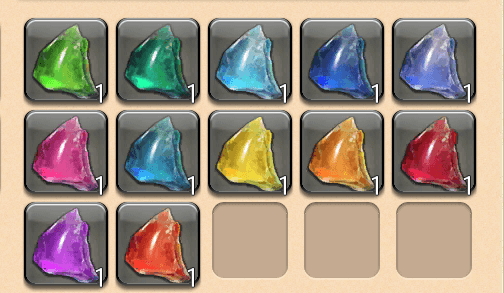
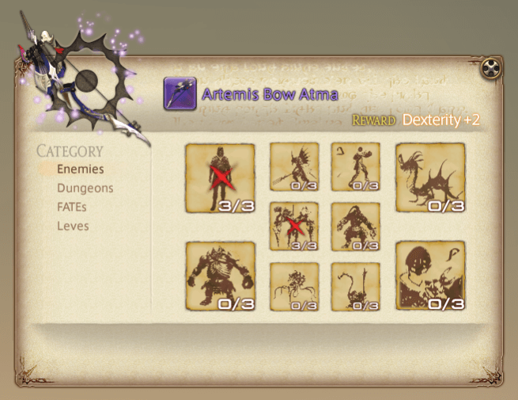
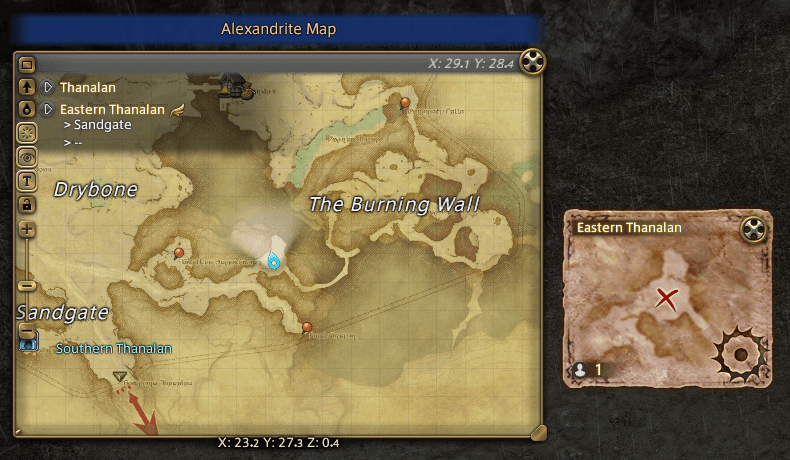
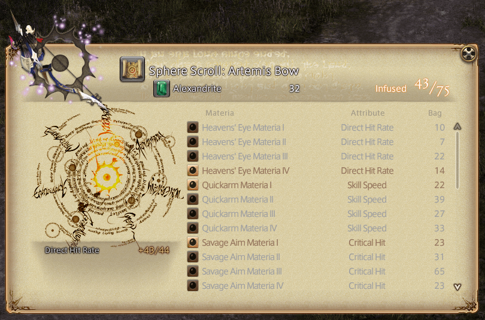
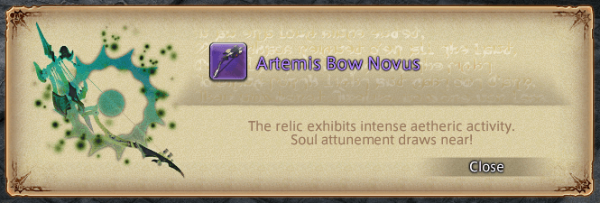
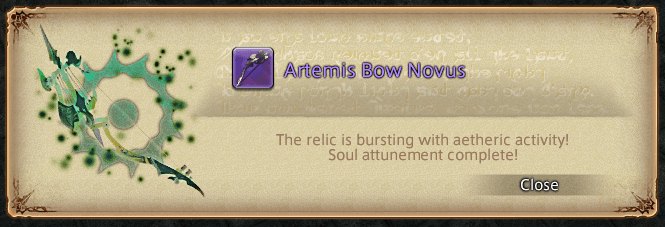
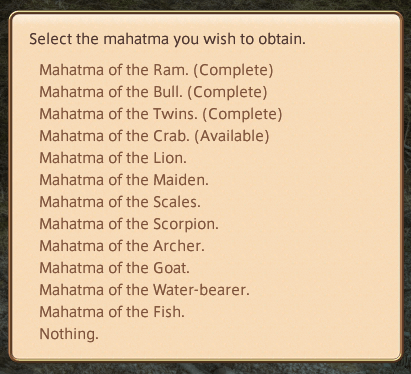
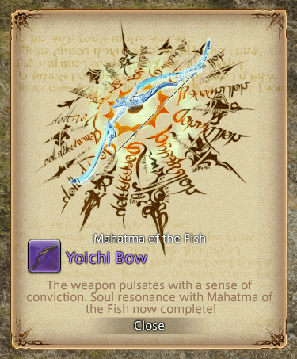

# Zodiac Weapons

!!! bug "Personal Note — To Do"
    - [ ] Add introduction paragraph.
    - [ ] Confirm steps to all stages by completing another Zodiac weapon.
    - [ ] Add associated quest names to all stages.
    - [ ] Confirm coordinates for all NPCs and enemies.
    - [ ] Confirm if it is possible to exchange a Trial of the Brave book before it is completed.
    - [ ] Add links to dungeon and trial pages.
    - [x] Optimize image file sizes.

## General Information

- At minimum, it will take several days to complete your A Realm Reborn relic weapon.
- I would recommend reaching maximum level to have an easier time grinding out this long and tedious quest chain.
- You can save gil by having all crafting jobs at level 50 or above. However, this is not necessary as you can purchase required crafted items from the Market Board.

!!! danger "Do not discard relic weapon"
    Do not discard your relic weapon! You will not be able to purchase any of the replicas without having the completed relic weapon in your inventory from [Drake](https://na.finalfantasyxiv.com/lodestone/playguide/db/shop/f2cb98f29d2/) (North Shroud, `X:30.3, Y:20.1`).

    If you accidently discarded your relic weapon, you will only be able to get back the initial step of the relic ([Zenith](#2-zenith)) from a Calamity Salvager NPC located in the main cities:

    - [Old Gridania](https://na.finalfantasyxiv.com/lodestone/playguide/db/shop/350cd619ffd/) (`X:10, Y:8.4`)
    - [Limsa Lominsa Upper Decks](https://na.finalfantasyxiv.com/lodestone/playguide/db/shop/9d03aec955c/) (`X:11.3, Y:14.3`)
    - [Ul'dah](https://na.finalfantasyxiv.com/lodestone/playguide/db/shop/67872c11c61/) (`X:12.6, Y:13.1`)

## Stages

1. [Relic](#1-base-relic)
2. [Zenith](#2-zenith)
3. [Atma](#3-atma)
4. [Animus](#4-animus)
5. [Novus](#5-novus)
6. [Nexus](#6-nexus)
7. [Zodiac Braves](#7-zodiac-braves)
8. [Zodiac Zeta](#8-zodiac-zeta)

## Prerequisites

- Completed Main Scenario Quest: [The Ultimate Weapon](https://na.finalfantasyxiv.com/lodestone/playguide/db/quest/3ab32cfebf8/)
- Completed all A Realm Reborn quests for your chosen job of: Paladin, Warrior, Monk, Dragoon, Bard, Ninja, Black Mage, Summoner, White Mage, or Scholar.
    - Any unlisted jobs here cannot obtain A Realm Reborn relic weapon.
- Have access to the following dungeons and trials:
    - Amdapor Keep
    - The Bowl of Embers (Hard)
    - The Howling Eye (Hard)
    - The Navel (Hard)
- Reached Second Lieutenant rank for your chosen Grand Company (i.e. Maelstrom, Immortal Flames, Twin Adder).

## Total Cost

!!! note ""
    Some items will not be available to purchase at Merchant NPCs until you have reached certain stages.

- 424,000+ gil:
    - To purchase required items from Merchant NPCs.
    - For teleport fees.
    - For materia, unless you have a substantial amount of Materia I, II, III, and IV.
    - *(If you cannot craft)* For purchasing crafted items from the Market Board.
- 80,000 Grand Company Seals:
    - 80,000 for Bombard Core (20,000 each x4)
- 1850—2975 Allagan Tomestones of Poetics:
    - 15 for Radz-At-Han Quenching Oil (x1)
    - 60 for Thavnairian Mist (20 each x3)
    - 900 for Trials of the Braves books (100 each x9)
    - 75 for Superior Enchanted Ink (25 each x3)
    - 800 for Sacred Spring Water (200 each x4)
    - *(Optional)* 1125 for Mysterious Maps (75 each x15) — Used for acquiring Alexandrite. However, this is an optional cost because there are other methods for acquiring Alexandrite. Unfortunately, these other methods are time-gated.

## 1. Base Relic

!!! summary "Cost"
    - Some gil.
        - If you plan to gather materials, craft the required weapon, and meld the Materia yourself, then this step will only cost time.
    - Two specific Materia III.
    - 15 Allagan Tomestones of Poetics for Radz-At-Han Quenching Oil (15 each x1)

### The Weaponsmith of Legend

1. Speak with [Nedrick Ironheart](https://na.finalfantasyxiv.com/lodestone/playguide/db/npc/npc/d2443942446/) (Western Thanalan, `X:12, Y:14.3`) to pick up the quest: [The Weaponsmith of Legend](https://na.finalfantasyxiv.com/lodestone/playguide/db/quest/b72db0c1975/)
    - You will only have to do this once per character.
    - Your next relic weapons will start from [A Relic Reborn](#a-relic-reborn) step.
2. Speak with [Rowena](https://na.finalfantasyxiv.com/lodestone/playguide/db/npc/npc/5f16dc7f440/) (Mor Dhona, `X:21.9, Y:4.9`).
3. Speak with [Gerolt](https://na.finalfantasyxiv.com/lodestone/playguide/db/npc/npc/c385edb82f2/) (North Shroud, `X:30.2, Y:20.2`).

### A Relic Reborn

!!! note
    - You must complete dungeons and trials as your chosen job to obtain the relic weapon.
    - You can complete dungeons and trials unsynced in an Unrestricted Party.
    - You will receive required items from dungeons and trials upon leaving the duty.

#### Timeworn Weapon

1. Locate and obtain the timeworn weapon which is job-specific.
2. Report back to Gerolt.
3. Purchase or craft the required weapon, then attach two specific Materia III.
    - For some gil, Materia Melder NPCs in major cities can meld Materia for you.
    - If you want to meld yourself, you must have completed the quest: [Waking the Spirit](https://na.finalfantasyxiv.com/lodestone/playguide/db/quest/494c4ff8e5a/)
4. Report back to Gerolt.

??? info "Required Crafted Weapons and Materia III"
    | Job        | Weapon                        | Materia                       |
    | :--------- | :---------------------------- | :---------------------------- |
    | Paladin    | Aeolian Scimitar              | Battledance Materia III (x2)  |
    | Warrior    | Barbarian's Bardiche          | Battledance Materia III (x2)  |
    | Monk       | Wildling's Cesti              | Savage Aim Materia III (x2)   |
    | Dragoon    | Champion's Lance              | Savage Aim Materia III (x2)   |
    | Bard       | Longarm's Composite Bow       | Heavens' Eye Materia III (x2) |
    | Ninja      | Vamper's Knives               | Heavens' Eye Materia III (x2) |
    | Black Mage | Sanguine Scepter              | Savage Might Materia III (x2) |
    | Summoner   | Erudite's Picatrix of Casting | Savage Might Materia III (x2) |
    | White Mage | Madman's Whispering Rod       | Quicktongue Materia III (x2)  |
    | Scholar    | Erudite's Picatrix of Healing | Quicktongue Materia III (x2)  |

!!! warning "Purchasing Crafted Weapons and Materia III from the Market Board"
    - If you are purchasing already melded weapons from the Market Board, ensure that the correct materia are melded before making your purchase. For example, if you are a Bard, do not purchase a Longarm's Composite Bow with two melded Battledance Materia III. You want a Longarm's Composite Bow with two melded Heavens' Eye Materia III.

#### The Chimera

1. Travel to Coerthas Central Highlands and examine the destination point.
2. Complete A Relic Reborn: The Chimera.
3. Report back to Gerolt.

#### Amdapor Glyphs

1. Speak with Rowena.
2. Complete Amdapor Keep.
3. Report back to Rowena and receive a book.
4. Deliver the book to Gerolt.

#### Slaying Beastmen

1. Equip your unfinished weapon.
2. Defeat 24 specific beastmen.
3. Report back to Gerolt.

??? info "Required Beastmen"
    | Job        | Location                                   | Enemies                                                                         |
    | :--------- | :----------------------------------------- | :------------------------------------------------------------------------------ |
    | Paladin    | Southern Thanalan - Zahar'ak               | Zahar'ak Lancer (x8) Zahar'ak Pugilist (x8) Zahar'ak Thaumaturge (x8)     |
    | Warrior    | Outer La Noscea - U'Ghamaro Mines          | 13th Order Bedesmen (x8) 13th Order Priest (x8) 13th Order Quarryman (x8) |
    | Monk       | Southern Thanalan - Zahar'ak               | Zahar'ak Archer (x8) Zahar'ak Lancer (x8) Zahar'ak Pugilist (x8)          |
    | Dragoon    | Coerthas Central Highlands - Natalan       | Natalan Boldwing (x8) Natalan Fogcaller (x8) Natalan Windtalon (x8)       |
    | Bard       | Coerthas Central Highlands - Natalan       | Natalan Boldwing (x8) Natalan Fogcaller (x8) Natalan Windtalon (x8)       |
    | Ninja      | Western La Noscea - Sapsa Spawning Grounds | Sapsa Shelfclaw (x8) Sapsa Shelfspine (x8) Sapsa Shelftooth (x8)          |
    | Black Mage | Outer La Noscea - U'Ghamaro Mines          | 13th Order Bedesmen (x8) 13th Order Priest (x8) 13th Order Quarryman (x8) |
    | Summoner   | East Shroud - Sylphlands                   | Violet Screech (x8) Violet Sigh (x8) Violet Snarl (x8)                    |
    | White Mage | Outer La Noscea - U'Ghamaro Mines          | 13th Order Bedesmen (x8) 13th Order Priest (x8) 13th Order Quarryman (x8) |
    | Scholar    | Western La Noscea - Sapsa Spawning Grounds | Sapsa Shelfclaw (x8) Sapsa Shelfspine (x8) Sapsa Shelftooth (x8)          |

#### The Hydra

1. Travel to Eastern Thanalan and examine the destination point.
2. Complete A Relic Reborn: The Hydra with the unfinished weapon equipped.
3. Report back to Gerolt with your unfinished weapon unequipped.

#### Primals

1. Complete the following trials:
    1. The Bowl of Embers (Hard)
    2. The Howling Eye (Hard)
    3. The Navel (Hard)
2. Report back to Gerolt.

#### Radz-At-Han Oil

1. Purchase Radz-At-Han Quenching Oil (x1) for 15 Poetics.
    - Sold by [Auriana](https://na.finalfantasyxiv.com/lodestone/playguide/db/shop/27773b8b4a7/) (Mor Dhona, `X:22.7, Y:6.6`) > `Special Arms` > `Others`
    - Sold by Rowena's Representatives in main cities > `Combat Supplies` > `Special Arms Materials`
2. Report back to Gerolt.
3. Congratulations! You have completed this stage.

## 2. Zenith

!!! summary "Cost"
    - 60 Allagan Tomestones of Poetics for Thavnairian Mist (20 each x3)

1. Purchase Thavnairian Mist (x3) for 20 Poetics each for a total of 60 Poetics.
    - Sold by [Auriana](https://na.finalfantasyxiv.com/lodestone/playguide/db/shop/27773b8b4a7/) (Mor Dhona, `X:22.7, Y:6.6`) > `Special Arms` > `Others`
    - Sold by Rowena's Representatives in main cities > `Combat Supplies` > `Special Arms Materials`
2. Use the furnace (North Shroud, `X:30.4, Y:20`) to combine your base relic weapon with the Thavnairian Mists.
3. Congratulations! You have completed this stage.

## 3. Atma

1. Speak with Gerolt with your relic weapon equipped.
2. Speak with [Jalzahn](https://na.finalfantasyxiv.com/lodestone/playguide/db/npc/npc/cd1713e6dc7/) (`X:29.5, Y:19.6`).
3. Collect 12 types of Atma crystals from successfully completing FATEs in specific zones.
4. Report back to Jalzahn.
    - Unequip your relic weapon.
    - Have the 12 types of Atma crystals in your inventory.
    - Select dialogue option: `Relic Weapon Zenith Enhancement`
5. Congratulations! You have completed this stage.

!!! info "Collecting Atma"
    - You must have a Zenith relic weapon equipped to get Atma.
    - Any FATE in the specified zone can drop Atma, but it must be successfully completed.
    - Atma crystals are not a guaranteed drop. You can get one from the first FATE you do in a zone, or it can be from the 20th FATE.

    | Region           | Zone              | Atma                     |
    | :--------------- | :---------------- | :----------------------- |
    | The Black Shroud | North Shroud      | Atma of the Archer       |
    | The Black Shroud | East Shroud       | Atma of the Goat         |
    | The Black Shroud | Central Shroud    | Atma of the Maiden       |
    | La Noscea        | Lower La Noscea   | Atma of the Fish         |
    | La Noscea        | Middle La Noscea  | Atma of the Ram          |
    | La Noscea        | Western La Noscea | Atma of the Crab         |
    | La Noscea        | Upper La Noscea   | Atma of the Water-bearer |
    | La Noscea        | Outer La Noscea   | Atma of the Lion         |
    | Thanalan         | Eastern Thanalan  | Atma of the Bull         |
    | Thanalan         | Southern Thanalan | Atma of the Scorpion     |
    | Thanalan         | Western Thanalan  | Atma of the Twins        |
    | Thanalan         | Central Thanalan  | Atma of the Scales       |

    

    !!! tip
        - When you receive an Atma, there will be an in-game popup notification. You can't miss it!
        - Atma will go into your inventory. Ensure that you have enough free inventory space!
        - You only need one type of Atma per relic weapon.
        - This is a a good opportunity to train your Chocobo companion in combat.

    !!! example "Personal Experience"
        It took me close to three hours to collect all Atma crystals.

## 4. Animus

!!! summary "Cost"
    - 900 Allagan Tomestones of Poetics for Trials of the Braves books (100 each x9)

1. Speak with Jalzahn with your relic weapon equipped.
2. Speak with [G'jusana](https://na.finalfantasyxiv.com/lodestone/playguide/db/npc/npc/740bd200eb8/) (Mor Dhona, `X:22.9, Y:7.3`).
    - She will sell you the nine required books, but you can only have one book at a time.
    - Each book will cost 100 Poetics for a total of 900 Poetics.
3. Complete tasks in all nine Trial of the Braves books.
    - You can complete the books in any order.
    - In each book, your tasks will be:
        - Killing 10 specific enemies.
        - Completing 3 specific dungeons.
        - Completing 3 specific FATEs.
        - Completing 3 specific levequests.
    - Review your tasks and progress from the book in your `Key Items` inventory.

    ??? example "Example of a Trial of the Braves book"
        

4. Report back to Jalzahn.
    - Unequip your relic weapon.
    - Select dialogue option: `Relic Weapon Atma Enhancement`
5. Congratulations! You have completed this stage.
    - For whatever reason, the last book will remain in your `Key Items` inventory.
    - To remove the last book, return to G'jusana and select dialogue option: `Disposal`

!!! tip
    - You must have your Atma relic weapon equipped when purchasing a book and completing tasks.
    - You can only have one book at a time.
    - For dungeons:
        - You can complete dungeons unsynced in an Unrestricted Party.
    - For FATEs:
        - If you do not see your required FATE, then you can clear other FATEs in the zone to try to force the one you need to spawn. Or wait for currently active FATEs to time out.
        - Some FATEs are triggered after certain events (e.g. after speaking with an NPC)
    - For leves:
        - There are two types of levequest NPCs — one for general leves and one for Grand Company leves. Ensure that you are speaking to the correct NPC.
        - If you do not see your required levequest, then you can clear out other levequests to try to force the one you need to spawn.
        - To start a levequest:
            1. Pick up the levequest.
            2. Go to the levequest location marked on your map.
            3. Open your quest Journal then initiate the quest.
            4. After completing the levequest, you are offered a teleport back to the levequest NPC.
    - This is a a good opportunity to train your Chocobo companion in combat.

!!! example "Personal Experience"
    This is a very time-consuming stage. Ready a music playlist, show series, or podcast. You are going to need it.

    I would recommend that you complete all tasks in one zone before moving onto the next zone to save yourself teleport fees. Generally, moving in this region order will be cheapest:

    1. Mor Dhona
    2. Coerthas Central Highlands
    3. The Black Shroud
    4. Thanalan
    5. La Noscea

    If a required FATE is not active when you teleport to the zone, I recommend you queue into the required dungeons for the book while waiting for the FATE to spawn. Check if the FATE is active between each dungeon. If you finish the required dungeons and the FATE hasn't spawned yet, then move onto the next zone or clear the currently active FATEs in the zone to try to force the one you need to spawn.

??? note "Book of Skyfire I"
    | Enemies                    | Location                                    |
    | :------------------------- | :------------------------------------------ |
    | 5th Cohort Vanguard (x3)   | Mor Dhona (`X:11, Y:15`)                    |
    | Daring Harring (x3)        | Mor Dhona (`X:16.8, Y:15.4`)                |
    | Giant Logger (x3)          | Coerthas Central Highlands (`X:14, Y:26.5`) |
    | Milkroot Cluster (x3)      | East Shroud (`X:24, Y:17`)                  |
    | Basilisk (x3)              | Northern Thanalan (`X:22, Y:26.9`)          |
    | 4th Cohort Hoplomachi (x3) | Western Thanalan (`X:11, Y:6.3`)            |
    | Zanr'ak Pugilist (x3)      | Southern Thanalan (`X:18.4, Y:24.7`)        |
    | 2nd Cohort Hoplomachi (x3) | Eastern La Noscea (`X:26.9, Y:21.1`)        |
    | Synthetic Doblyns (x3)     | Outer La Noscea (`X:21.7, Y:9.2`)           |
    | Shoalspine Sahagin (x3)    | Western La Noscea (`X:17.1, Y:16.9`)        |

    | Dungeons                 |
    | :----------------------- |
    | The Tam-Tara Deepcroft   |
    | The Stone Vigil          |
    | The Lost City of Amdapor |

    | FATEs                  | Location                                                                                                                                                          |
    | :--------------------- | :---------------------------------------------------------------------------------------------------------------------------------------------------------------- |
    | Giant Seps             | The Coerthas Central Highlands (`X:8.6, Y:12.1`)                                                                                                                  |
    | Make It Rain           | Outer La Noscea (`X:25.1, Y:17.7`)                                                                                                                                |
    | The Enmity of My Enemy | The East Shroud (`X:27, Y:21.6`)  Prerequisites to spawn: 1. Speak to Mianne Thousandmalm (`X:28.2, Y:20.3`). 2. Complete FATE The Enemy of My Enemy. |

    | Leves                     | Location                   | NPC                                       |
    | :------------------------ | :------------------------- | :---------------------------------------- |
    | Necrologos: Pale Oblation | Northern Thanalan          | Rurubana (`X:22.1, Y:29.4`) — Battlecraft |
    | An Imp Mobile             | Coerthas Central Highlands | Lodille (`X:11.9, Y:16.8`) — Maelstrom    |
    | The Awry Salvages         | Mor Dhona                  | Eidhart (`X:30.7, Y:12.1`) — Twin Adder   |

??? note "Book of Skyfire II"
    | Enemies                 | Location                                              |
    | :---------------------- | :---------------------------------------------------- |
    | Raging Harrier (x3)     | Mor Dhona (`X:16.9, Y:15.9`)                          |
    | Natalan Boldwing (x3)   | Coerthas Central Highlands (`X:32.5, Y:18.3`)         |
    | Biast (x3)              | Coerthas Central Highlands (`X:16.9, Y:29.9`)         |
    | Dullahan (x3)           | North Shroud (`X:22.4, Y:19.9`)                       |
    | Sylpheed Sigh (x3)      | East Shroud (`X:28.7, Y:17.5`) and (`X:29.8, Y:11.8`) |
    | Tempered Gladiator (x3) | Southern Thanalan (`X:21.1, Y:19.5`)                  |
    | Zahar'ak Archer (x3)    | Southern Thanalan (`X:26.9, Y:21.2`)                  |
    | U'Ghamaro Golem (x3)    | Outer La Noscea (`X:27.3, Y:7.2`)                     |
    | Shelfscale Reaver (x3)  | Western La Noscea (`X:13.4, Y:16.9`)                  |
    | Shoaltooth Sahagin (x3) | Western La Noscea (`X:17, Y:16.9`)                    |

    | Dungeons                |
    | :---------------------- |
    | Brayflox's Longstop     |
    | The Wanderer's Palace   |
    | Copperbell Mines (Hard) |

    | FATEs                    | Location                                                                                                                      |
    | :----------------------- | :---------------------------------------------------------------------------------------------------------------------------- |
    | Breaching South Tidegate | Western La Noscea (`X:18, Y:22`)  Prerequisites to spawn: 1. Complete FATE Gauging South Tidegate (`X:18.8, Y:21.8`) |
    | Heroes of the 2nd        | Southern Thanalan (`X:21.2, Y:16.6`)                                                                                          |
    | Air Supply               | North Shroud (`X:19.4, Y:19.2`)                                                                                               |

    | Leves                   | Location                   | NPC                                         |
    | :---------------------- | :------------------------- | :------------------------------------------ |
    | Don't Forget to Cry     | Northern Thanalan          | Rurubana (`X:22.1, Y:29.4`) — Battlecraft   |
    | Yellow is the New Black | Coerthas Central Highlands | Lodille (`X:11.9, Y:16.8`) — Twin Adder     |
    | The Museum is Closed    | Mor Dhona                  | Eidhart (`X:30.7, Y:12.1`) — Immortal Flams |

??? note "Book of Netherfire I"
    | Enemies                     | Location                                              |
    | :-------------------------- | :---------------------------------------------------- |
    | Hexing Harrier (x3)         | Mor Dhona (`X: 17, Y:16.9`)                           |
    | Gigas Bonze (x3)            | Mor Dhona — North Silvertear                          |
    | Giant Lugger (x3)           | Coerthas Central Highlands (`X:12.2, Y:26.7`)         |
    | Sylpheed Screech (x3)       | East Shroud (`X:29.1, Y:13.1`)                        |
    | Wild Hog (x3)               | South Shroud(`X:30.1, Y:24.9`)                        |
    | Tempered Orator (x3)        | Southern Thanalan (`X:21.2, Y:19.6`)                  |
    | Zahar'ak Fortuneteller (x3) | Southern Thanalan (`X:29.3, Y:19.8`)                  |
    | 2nd Cohort Laquearius (x3)  | Eastern La Noscea (`X:27.4, Y:21.2`)                  |
    | U'Ghamaro Roundsman (x3)    | Outer La Noscea (`X:23.8, Y:9.3`) and `X:23.8, Y:7.1` |
    | Shelfclaw Reaver (x3)       | Western La Noscea (`X:13.5, Y:17`)                    |

    | Dungeons                  |
    | :------------------------ |
    | The Sunken Temple of Qarn |
    | Haukke Manor (Hard)       |
    | Halatali (Hard)           |

    | FATEs                      | Location                             |
    | :------------------------- | :----------------------------------- |
    | Another Notch on the Torch | Mor Dhona (`X:31, Y:5`)              |
    | Everything's Better        | East Shroud (`X:23.7, Y:14.5`)       |
    | Return to Cinder           | Southern Thanalan (`X:24.5, Y:26.3`) |

    | Leves                  | Location                   | NPC                                          |
    | :--------------------- | :------------------------- | :------------------------------------------- |
    | Circling the Ceruleum  | Northern Thanalan          | Rurubana (`X:22.1, Y:29.4`) — Battlecraft    |
    | If You Put It That Way | Coerthas Central Highlands | Lodille (`X:11.9, Y:16.8`) — Immortal Flames |
    | One Big Problem Solved | Mor Dhona                  | Eidhart (`X:30.7, Y:12.1`) — Maelstrom       |

??? note "Book of Skyfall I"
    | Enemies                  | Location                                      |
    | :----------------------- | :-------------------------------------------- |
    | Mudpuppy (x3)            | Mor Dhona (`X:14.4, Y:10.7`)                  |
    | Lake Cobra (x3)          | Mor Dhona (`X:24.7, Y:12.6`)                  |
    | Giant Reader (x3)        | Coerthas Central Highlands (`X:13.5, Y:26.9`) |
    | Sylphlands Sentinel (x3) | East Shroud (`X:24.4, Y:11.2`)                |
    | Magitek Vanguard (x3)    | Northern Thanalan (`X:17, Y:17`)              |
    | Amalj'aa Lancer(x3)      | Southern Thanalan (`X:20, Y:20`)              |
    | 2nd Cohort Eques (x3)    | Eastern La Noscea (`X:26.2, Y:21.2`)          |
    | U'Ghamaro Quarryman (x3) | Outer La Noscea (`X:23, Y:7.7`)               |
    | Shelfscale Sahagin (x3)  | Western La Noscea (`X:18.6, Y:21.7`)          |
    | Sea Wasp (x3)            | Western La Noscea (`X:14.3, Y:17.1`)          |

    | Dungeons                   |
    | :------------------------- |
    | Copperbell Mines           |
    | Dzemael Darkhold           |
    | Brayflox's Longstop (Hard) |

    | FATEs              | Location                                                                                                                                                      |
    | :----------------- | :------------------------------------------------------------------------------------------------------------------------------------------------------------ |
    | Bellyfull          | Coerthas Central Highlands (`X:34.4, Y:13.8`)                                                                                                                 |
    | The King's Justice | Western La Noscea (`X:14.5, Y:34.5`)  How to get to FATE: Speak to the Ferry Skipper at Aleport (`X:27.8, Y:28.5`). Travel to the Isles of Umbra. |
    | Quartz Coupling    | Eastern Thanalan (`X:26, Y:24.6`)                                                                                                                             |

    | Leves                           | Location                   | NPC                                        |
    | :------------------------------ | :------------------------- | :----------------------------------------- |
    | Circling the Ceruleum           | Northern Thanalan          | Rurubana (`X:22.1, Y:29.4`) — Battlecraft  |
    | Necrologos: Whispers of the Gem | Coerthas Central Highlands | Voilinaut (`X:12.6, Y:16.7`) — Battlecraft |
    | Go Home to Mama                 | Mor Dhona                  | Eidhart (`X:30.7, Y:12.1`) — Maelstrom     |

??? note "Book of Skyfall II"
    | Enemies                     | Location                                                    |
    | :-------------------------- | :---------------------------------------------------------- |
    | 5th Cohort Hoplomachus (x3) | Mor Dhona (`X:12.6, Y:12.2`)                                |
    | Gigas Bhikkhu (x3)          | Mor Dhona (`X:32.9, Y:14.9`)                                |
    | Natalan Watchwolf (x3)      | Coerthas Central Highlands (`X:33.2, Y:20.6`)               |
    | Ked (x3)                    | South Shroud (`X:31.7, Y:23.9`)                             |
    | Sylph Bonne (x3)            | East Shroud (`X:26, Y:13.4`)                                |
    | Iron Tortoise (x3)          | Southern Thanalan (`X:18.8, Y:23.3`) and (`X:16.2, Y:24.7`) |
    | 4th Cohort Laquearius (x3)  | Western Thanalan (`X:13.5, Y:6.6`)                          |
    | U'Ghamaro Bedesman (x3)     | Outer La Noscea (`X:23, Y:9.9`) and (`X:22, Y:6`)           |
    | Shelfeye Reaver (x3)        | Western La Noscea (`X:13, Y:17`)                            |
    | Sapsa Shelfscale (x3)       | Western La Noscea (`X:13.1, Y:14.6`)                        |

    | Dungeons                      |
    | :---------------------------- |
    | The Thousand Maws of Toto-Rak |
    | Amdapor Keep                  |
    | Haukke Manor (Hard)           |

    | FATEs                    | Location                                                                                                               |
    | :----------------------- | :--------------------------------------------------------------------------------------------------------------------- |
    | Breaching North Tidegate | Western La Noscea (`X:20.7, Y:19.1`)  Prerequisite: 1. Complete FATE Gauging North Tidegate (`X:21, Y:19.3`). |
    | Black and Nburu          | Mor Dhona (`X:16.6, Y:14.3`)                                                                                           |
    | Breaking Dawn            | East Shroud (`X:32, Y:14.2`)                                                                                           |

    | Leves                     | Location                   | NPC                                        |
    | :------------------------ | :------------------------- | :----------------------------------------- |
    | Someone's in the Doghouse | Northern Thanalan          | Rurubana (`X:22.1, Y:29.4`) — Battlecraft  |
    | The Area's a Bit Sketchy  | Coerthas Central Highlands | Voilinaut (`X:12.6, Y:16.7`) — Battlecraft |
    | Get Off Our Lake          | Mor Dhona                  | Eidhart (`X:30.7, Y:12.1`) — Twin Adder    |

??? note "Book of Netherfall I"
    | Enemies                    | Location                                                  |
    | :------------------------- | :-------------------------------------------------------- |
    | 5th Cohort Laquearius (x3) | Mor Dhona (`X:12.3, Y:12.3`)                              |
    | Gigas Sozu (x3)            | Mor Dhona — North Silvertear                              |
    | Snow Wolf (x3)             | Coerthas Central Highlands (`x:16.2, Y:31.6`)             |
    | Lesser Kalong (x3)         | North Shroud (`X:22, Y:19.8`)                             |
    | Ixali Windtalon (x3)       | North Shroud(`X:20.3, Y:20.2`)                            |
    | Violet Screech (x3)        | East Shroud (`X:23.7, Y:14.7`) and (`X:25.3, Y:17`)       |
    | Amalj'aa Brigand (x3)      | Southern Thanalan (`X:18.8, Y:20.1`) and (`X:20.7, 21.6`) |
    | 4th Cohort Secutor (x3)    | Western Thanalan (`X:9.9, Y:5.7`)                         |
    | U'Ghamaro Priest (x3)      | Outer La Noscea (`X:22.1, Y:6.1`) and (`X:23.8, Y:5.7`)   |
    | Sapsa Shelfclaw (x3)       | Western La Noscea (`X:15.8, Y:14.2`)                      |

    | Dungeons                 |
    | :----------------------- |
    | Cutter's Cry             |
    | Pharos Sirius            |
    | The Lost City of Amdapor |

    | FATEs             | Location                                                                                                                                           |
    | :---------------- | :------------------------------------------------------------------------------------------------------------------------------------------------- |
    | Rude Awakening    | North Shroud (`X:22, Y:20`)                                                                                                                        |
    | The Ceruleum Road | Northern Thanalan Begins at `X:21.8, Y:29` and ends at `X:22, Y:22.1`.  Prerequisite: 1. Speak to the Wary Merchant (`X:21.8, Y:29.4`) |
    | The Four Winds    | Coerthas Central Highlands (`X:34.4, Y:21.2`)                                                                                                      |

    | Leves                        | Location                   | NPC                                          |
    | :--------------------------- | :------------------------- | :------------------------------------------- |
    | Got a Gut Feeling about This | Coerthas Central Highlands | Voilinaut (`X:12.6, Y:16.7`) — Battlecraft   |
    | Subduing the Subprime        | Northern Thanalan          | Rurubana (`X:22.1, Y:29.4`) — Battlecraft    |
    | Who Writes History           | Mor Dhona                  | Eidhart (`X:30.7, Y:12.1`) — Immortal Flames |

??? note "Book of Skywind I"
    | Enemies                   | Location                                               |
    | :------------------------ | :----------------------------------------------------- |
    | 5th Cohort Eques (x3)     | Mor Dhona (`X:12.3, Y:11.8`)                           |
    | Hippogryph (x3)           | Mor Dhona (`X:33.1, Y:11.8`)                           |
    | Natalan Windtalon (x3)    | Coerthas Central Highlands (`X:31.6, Y:17.5`)          |
    | Sylpheed Snarl (x3)       | East Shroud  (`X:29.1, Y:13.9`)                        |
    | Ahriman (x3)              | Northern Thanalan (`X:24.4, Y:21.8`)                   |
    | Amalj'aa Thaumaturge (x3) | Southern Thanalan (`X:19, Y:19.7`)                     |
    | 2nd Cohort Secutor (x3)   | Eastern La Noscea (`X:25.5, Y:20.8`)                   |
    | Elite Roundsman (x3)      | Outer La Noscea  (`X:25, Y:8.4`) and (`X:26.9, Y:5.1`) |
    | Trenchtooth Sahagin (x3)  | Western La Noscea (`X:19.9, Y:20`)                     |
    | Sapsa Elbst (x3)          | Western La Noscea (`X:17.6, Y:15.8`)                   |

    | Dungeons        |
    | :-------------- |
    | Sastasha        |
    | The Aurum Vale  |
    | Halatali (Hard) |

    | FATEs              | Location                                                                                                              |
    | :----------------- | :-------------------------------------------------------------------------------------------------------------------- |
    | Surprise           | Upper La Noscea (`X:26.9,y Y:19.3`)  Recommend camping spawn because the NPC will die quickly if not protected. |
    | In Spite of It All | Central Shroud (`X:11.4, Y:18.2`)  Located in cave underground. Entrance to cave is at `X:10.7, Y:16.7`.        |
    | Good to Be Bud     | Mor Dhona (`X:13.5, Y:12`)                                                                                            |

    | Leves                     | Location                   | NPC                                       |
    | :------------------------ | :------------------------- | :---------------------------------------- |
    | Subduing the Subprime     | Northern Thanalan          | Rurubana (`X:22.1, Y:29.4`) — Battlecraft |
    | Big, Bad Idea             | Mor Dhona                  | K'leytai (`X:29.8, Y:12.5`) — Battlecraft |
    | Someone's Got a Big Mouth | Coerthas Central Highlands | Lodille (`X:11.9, Y:16.8`) — Maelstrom    |

??? note "Book of Skywind II"
    | Enemies                    | Location                                                  |
    | :------------------------- | :-------------------------------------------------------- |
    | 5th Cohort Signifer (x3)   | Mor Dhona (`X:12.4, Y:12.5`)                              |
    | Gigas Shramana (x3)        | Mor Dhona (`X:28, Y:13`)                                  |
    | Natalan Fogcaller (x3)     | Coerthas Central Highlands (`X:32.6, Y:18.2`)             |
    | Watchwolf (x3)             | North Shroud (`X:19.4, Y:20`)                             |
    | Dreamtoad (x3)             | East Shroud (`X:27, Y:18.2`)                              |
    | 4th Cohort Signifer (x3)   | Western Thanalan  (`X:12.4, Y:6.5`)                       |
    | Amalj'aa Archer (x3)       | Southern Thanalan (`X:20.5, Y:22.4`) and (`X:19.2, Y:26`) |
    | Zahar'ak Battle Drake (x3) | Southern Thanalan (`X:29.6, Y:19.4`)                      |
    | Elite Priest (x3)          | Outer La Noscea (`X:24.5, Y:7.5`) and (`X:26.6, Y:5.4`)   |
    | Sapsa Shelftooth (x3)      | Western La Noscea (`X:15.1, Y:15.4`)                      |

    | Dungeons                   |
    | :------------------------- |
    | Haukke Manor               |
    | Copperbell Mines (Hard)    |
    | Brayflox's Longstop (Hard) |

    | FATEs             | Location                                                                                                                                     |
    | :---------------- | :------------------------------------------------------------------------------------------------------------------------------------------- |
    | Taken             | Southern Thanalan (`X:18.2, Y:19.6`)                                                                                                         |
    | Tower of Power    | Coerthas Central Highlands (`X:11.2, Y:29.3`)  Prerequisite: 1. Speak with NPC House Haillenarte Guard (`X:10.4, Y:28.6`) to start. |
    | What Gored Before | South Shroud (`X:32.2, Y:25.4`)                                                                                                              |

    | Leves                       | Location                   | NPC                                       |
    | :-------------------------- | :------------------------- | :---------------------------------------- |
    | Necrologos Pale Oblation    | Northern Thanalan          | Rurubana (`X:22.1, Y:29.4`) — Battlecraft |
    | Put Your Stomp on It        | Mor Dhona                  | K'leytai (`X:29.8, Y:12.5`) — Battlecraft |
    | The Bloodhounds of Coerthas | Coerthas Central Highlands | Lodille (`X:11.9, Y:16.8`) — Twin Adder   |

??? note "Book of Skyearth I"
    | Enemies                  | Location                                                             |
    | :----------------------- | :------------------------------------------------------------------- |
    | 5th Cohort Secutor (x3)  | Mor Dhona (`X:12, Y:12.4`)                                           |
    | Hapalit (x3)             | Mor Dhona (`X:30.5 Y:6.2`)                                           |
    | Natalan Swiftbeak (x3)   | Coerthas Central Highlands (`X:31.4, Y:17.6`) and (`X:34.4, Y:21.9`) |
    | Ixali Boldwing (x3)      | North Shroud (`X:20.7, Y:18.8`)                                      |
    | Violet Sigh (x3)         | East Shroud (`X:24.6, Y:10.5`) and (`X:24.1, Y:13.7`)                |
    | Amalj'aa Scavenger (x3)  | Southern Thanalan (`X:18.6, Y:19.9`) and (`X:21.6, Y:21.8`)          |
    | Zahar'ak Pugilist        | Southern Thanalan (`X:28.5, Y:20.7`)                                 |
    | Elite Quarryman (x3)     | Outer La Noscea (`X:24.8, Y:7.2`) and (`X:27, Y:5.5`)                |
    | 2nd Cohort Signifer (x3) | Eastern La Noscea (`X:25.7, Y:21.2`)                                 |
    | Axolotl (x3)             | Western La Noscea (`X:14, Y:15.5`)                                   |

    | Dungeons      |
    | :------------ |
    | Halatali      |
    | Amdapor Keep  |
    | Pharos Sirius |

    | FATEs                 | Location                                                                                                                                                           |
    | :-------------------- | :----------------------------------------------------------------------------------------------------------------------------------------------------------------- |
    | The Taste of Fear     | Coerthas Central Highlands (`X:5.4, Y:21.9`)                                                                                                                       |
    | Schism                | Outer La Noscea (`X:25, Y:16`)  Prerequisites: 1. Speak with Storm Private (`X:23.8, Y:16.4). 2. Destroy all Kobold Toolboxes to summon the FATE boss. |
    | The Big Bagoly Theory | Eastern Thanalan (`X:30.1, Y:25.4`)                                                                                                                                |

    | Leves                        | Location                   | NPC                                          |
    | :--------------------------- | :------------------------- | :------------------------------------------- |
    | Don't Forget to Cry          | Northern Thanalan          | Rurubana (`X:22.1, Y:29.4`) — Battlecraft    |
    | Necrologos: The Liminal Ones | Mor Dhona                  | K'leytai (`X:29.8, Y:12.5`) — Battlecraft    |
    | No Big Whoop                 | Coerthas Central Highlands | Lodille (`X:11.9, Y:16.8`) — Immortal Flames |

## 5. Novus

!!! summary "Cost"
    - 75 Allagan Tomestones of Poetics for Superior Enchanted Ink (25 each x3)
    - *(Optional)* 1125 Allagan Tomestones of Poetics for Mysterious Maps (75 each x15)
    - You will need a lot of Materia I, II, III and/or IV, or gil to purchase them from the Market Board.

### Celestial Radiance

1. Speak with Jalzahn with your relic weapon equipped.
2. Speak with [Mutamix Bubblypots](https://na.finalfantasyxiv.com/lodestone/playguide/db/npc/npc/cd74a28508b/) (Central Thanalan, `X:23.7, Y:13.6`).
3. Speak with Hubairtin (Central Thanalan, `X:23.5, Y:13.7`).
4. Speak with Rowena.
5. Purchase Superior Enchanted Ink (x3) for 25 Poetics each for a total of 75 Poetics.
    - Sold by [Auriana](https://na.finalfantasyxiv.com/lodestone/playguide/db/shop/27773b8b4a7/) (Mor Dhona, `X:22.7, Y:6.6`) > `Special Arms` > `Others`
    - Sold by Rowena's Representatives in main cities > `Combat Supplies` > `Special Arms Materials`
6. Report back to Hubairtin.

### Star Light, Star Bright

1. Speak with Jalzahn.
2. Speak with Hubairtin.
    - Select dialogue option: `Sphere Scrolls` > `Obtain a sphere scroll`
3. Complete your Sphere Scroll by successfully binding 75 materia of various grades.
    - However, you cannot bind materia the conventional way.
    - You will need Alexandrite (x75) to bind materia.

    !!! question "Where to get Alexandrite?"
        1. Complete FATEs with an Animus zodiac weapon equipped. It will drop randomly.
        2. Purchased from your Grand Company's Hunt Billmaster for 50 Allied Seals each for a total of 3,750 Allied Seals.
        3. From treasure chests from Mysterious Maps.
            - Requires completed quest: [Treasures and Tribulations](https://na.finalfantasyxiv.com/lodestone/playguide/db/quest/66be24fd65b/)
            - Allows you the ability to `Actions & Traits` > `General` > `Decipher` and `Dig` treasure maps.
            - See more information about this method below.

4. Report back to Jalzahn after you have completed your Sphere Scroll.
    - Unequip your relic weapon.
    - Select dialogue option: `Relic Weapon Animus Enhancement`
5. Congratulations! You have completed this stage.

??? info "Mysterious Maps: Method 1 — Daily Duty Roulette"
    1. Speak with Ealdwine (North Shroud, `X:29.5, Y:19.7`) to pick up quest: [One Man's Trash](https://na.finalfantasyxiv.com/lodestone/playguide/db/quest/e07310dc045/)
    2. Speak with [Brangwine](https://na.finalfantasyxiv.com/lodestone/playguide/db/npc/npc/2936f6414cc/) (Mor Dhona, `X:21.9, Y:6.7`).
    3. She will offer a daily quest [Morbid Motivation](https://na.finalfantasyxiv.com/lodestone/playguide/db/quest/ff0d9aa6841/) which will reward one Mysterious Map. This quest requires you to complete a Duty Roulette.

??? info "Mysterious Maps: Method 2 — Purchase with 1,125 Allagan Tomestones of Poetics"
    1. Speak to Auriana > `Mysterious Map Exchange`
        - Purchase a Mysterious Map (x15) for 75 Poetics each for a total of 1,125 Poetics.
        - You can only hold a maximum of three Mysterious Maps at a time.
    2. Deciper the map in your inventory by right-clicking the map > `Decipher`

    3. Find the location marked on your mysterious map.
    4. Use `Action & Traits` > `General` > `Dig` > Loot Treasure Coffer
    5. You will receive Alexandrite (x5) from each Mysterious Map.

    !!! question "How to carry multiple Mysterious Maps?"
        1. Buy a map and place it in your Chocobo's saddlebag.
        2. Buy a second map and `decipher` it.
        3. Buy a third map and leave it in your inventory.

        Doing this allows you to hold three maps at the same time which means that you will only need to return to Auriana five times to to get all the Alexandrite you need.

    ??? example "Example of a Mysterious Map"
        

!!! info "Sphere Scroll"
    - Once you have obtained 75 Alexandrite, you will need to infuse them into your Sphere Scroll by right-clicking the scroll > `Infuse`
    - You will start with Materia I, then move on to II, III, and IV.
        - Since this is an outdated weapon, what materia stats you infuse does not really matter. Either use materia that you have on hand, or purchase whatever is cheapest on the Market Board.
        - There is a maximum cap for secondary stats for each relic weapon.
        - You can infuse up to a maximum of five different secondary stats.
    - As you start infusing materia, the infusion success rate will depreciate until you are forced to use a higher grade materia.
        - If the infusion fails, the materia is lost, but the Alexandrite is not consumed.

    ??? example "Example of a Partially Completed Sphere Scroll"
        

## 6. Nexus

1. Speak with Jalzahn with your relic weapon equipped.
    - Play messenger between Jalzahn and Gerolt a couple times.
    - You will eventually receive a Zodiac Glass from Jalzahn.
2. Speak with Jalzahn again.
    - Select dialogue option:`Relic Weapon Novus Soulglazing`
3. Earn 2000 light points by completing various activities:
    - A Realm Reborn FATEs
    - A Realm Reborn trials
    - A Realm Reborn dungeons
    - Alexandrite Maps
4. You have earned enough light when your weapon is `bursting with aetheric activity. Soul attunement complete!`
5. Report back to Jalzahn.
    - Unequip your Novus weapon.
    - Select dialogue option: `Relic Weapon Novus Enhancement`
6. Congratulations! You have completed this stage.

!!! info "Light Points"
    - You will need to obtain 2000 light points. However, there is no numerical indicator in the game. Instead, you can use the Zodiac Glass to determine your progress:

        | Light Level | Light Value |
        | :---------- | :---------: |
        | No Activity |    0-199    |
        | Indistinct  |   200-399   |
        | Faint       |   400-599   |
        | Slight      |   600-799   |
        | Modest      |   800-999   |
        | Distinct    |  1000-1199  |
        | Robust      |  1200-1399  |
        | Vigorous    |  1400-1599  |
        | Intense     |  1600-1799  |
        | Extreme     |  1800-1999  |
        | Bursting    |    2000+    |

    ??? example "Examples of Using the Zodiac Glass"
        
        

    - Complete various activities to earn light points:

        | Light Earned | Light Value |
        | :----------- | :---------: |
        | Feeble       |      8      |
        | Gentle       |     16      |
        | Bright       |     32      |
        | Brilliant    |     48      |
        | Blinding     |     96      |
        | Newborn Star |     128     |

    - Some activities will randomly yield bonus light points for a certain time.

        | Activities                    | Light Earned | Base Value | Bonus Value |
        | :---------------------------- | :----------- | :--------: | :---------: |
        | FATEs                         | ?            |     ?      |      ?      |
        | Primals (Hard)                | Gentle       |     16     |     32      |
        | Primals (Extreme)             | Gentle       |     16     |     32      |
        | Sastasha                      | Brilliant    |     48     |     96      |
        | The Tam-Tara Deepcroft        | Brilliant    |     48     |     96      |
        | Brayflox's Longstop           | Brilliant    |     48     |     96      |
        | The Aurum Vale                | Brilliant    |     48     |     96      |
        | The Labyrinth of the Ancients | ?            |     ?      |      ?      |
        | Syrcus Tower                  | ?            |     ?      |      ?      |
        | The World of Darkness         | ?            |     ?      |      ?      |

!!! example "Personal Experience"
    I would recommend running The Aurum Vale unsycned repeatedly until you have earned all 2000 light points. It is less tedious than running Sastasha or Tam-Tara Deepcroft because you don't have to interact with anything to progress through the dungeon. You only have to kill 6 enemies. You can run through all enemies except 3 Goldvine morbols to open walls and the 3 bosses. At the end of the dungeon, open the `Duty Finder` > `Leave` to quickly exit the duty. If you try to exit through the portal at the end, you risk being interrupted by all the enemies you skipped that followed you.

    As a level 90 Bard, one Aurum Vale run took about 2 minutes and 10 seconds and gave Brilliant light (48 points). Thus, it will take 42 runs of Aurum Vale to acquire enough light points. Otherwise stated, about two hours of continuous farming.

## 7. Zodiac Braves

!!! summary "Cost"
    - 424,000 gil
    - Even more gil if you do not have all crafting jobs at 50+ level
    - 800 Allagan Tomestones of Poetics for Sacred Spring Water (200 each x4)
    - 80,000 Grand Company Seals for Bombard Core (20,000 each x4)

### Wherefore Art Thou, Zodiac

1. Speak to Jalzahn with your relic weapon equipped.
2. Speak to Gerolt.
3. Speak to Jalzahn again.

### Obtain All the Things

1. Complete four quests:
    - [A Labor of Love](https://na.finalfantasyxiv.com/lodestone/playguide/db/quest/cd22a5b2b9e/) from Guiding Star (Mor Dhona, `X:21.9, Y:6.9`)
    - [A Treasured Mother](https://na.finalfantasyxiv.com/lodestone/playguide/db/quest/bc589dd6bff/) from Brangwine (Mor Dhona, `X:21.9, Y:6.7`)
        - If the quest is not available for you, then you have to complete quest: [One Man's Trash](https://na.finalfantasyxiv.com/lodestone/playguide/db/quest/e07310dc045/)
    - [A Ponze of Flesh](https://na.finalfantasyxiv.com/lodestone/playguide/db/quest/69755431807/) from Papana (Mor Dhona, `X:22.9, Y:7.3`)
    - [Method in His Malice](https://na.finalfantasyxiv.com/lodestone/playguide/db/quest/484dab85cd3/) from Adkin (Central Thanalan, `X:23.6, Y:13.7`)
2. Each quest requires:
    - 20,000 Grand Company seals
    - 200 Allagan Tomestones of Poetics
    - 100,000 gil
    - Two high-quality items which can be crafted or purchased from the Market Board
    - Complete four specific dungeons
3. Report back to Gerolt.
4. Speak with Mutamix Bubblypots.
5. Report back to Gerolt.
6. Speak with Jalzahn.
    - Unequip your weapon.
    - Select dialog option: `Zodiac Wepaon Recreation`
    - Don't worry! Although the next dialogue will tell you that the process has a 1.4% chance of success and that the relic will be lost if it fails, the process is 100% guaranteed to be successful.

??? info "Purchased Items"
    - Some items will not be available to purchase at Merchant NPCs until you have reached certain steps.

    | Item                    | Cost                        | Location                                                           |
    | :---------------------- | :-------------------------- | :----------------------------------------------------------------- |
    | Allaghan Resin (x1)     | 100,000 gil                 | Southern Thanalan Merchant & Mender (`X:15.9, Y:29`)            |
    | Brass Kettle (x1)       | 100,000 gil                 | North Shroud Tool Supplier & Mender (`X:29.8, Y:18.9`)          |
    | Bronze Lake Crystal     | 100,000 gil                 | Upper La Noscea Junkmoner (`X:26.1, Y:26.4`)                    |
    | Furite Sand             | 100,000 gil                 | Coerthas Central Highlands Merchant & Mender (`X:13.2, Y:15.9`) |
    | Sacred Spring Water(x4) | 800 Poetics                 | [Auriana](https://na.finalfantasyxiv.com/lodestone/playguide/db/shop/27773b8b4a7/) (Mor Dhona, `X:22.7, Y:6.6`) Rowena's Representatives in main cities     |
    | Bombard Core (x4)       | 80,0000 Grand Company seals | Your chosen Grand Company's Quartermaster                          |

??? info "Crafted Items"
    - To craft:
        - You must be able to craft the first tier of the Master Recipes (1) book for each job which can be purchased from Talan (Mor Dhona, `X:21.9, Y:6.8`).
        - You must be able to desynthesize items from each crafting job.
        - Each recipe requires an ingredient that is desynthesized from an item sold by the Merchant & Mender (Western Thanalan, `X:15, Y:29`) for 3,000 gil.
    - Or you can purchase these items from the Market Board. Ensure you are purchasing high-quality items!

    | Required Item            | Crafter       | Desynth Ingredient     | Source Item   |
    | :----------------------- | :------------ | :--------------------- | :------------ |
    | Perfect Pounce (HQ)      | Alchemist     | Dried Ether            | Aged Phial    |
    | Perfect Mortar (HQ)      | Armorer       | Aged Mortar Pieces     | Aged Mortar   |
    | Perfect Firewood (HQ)    | Carpenter     | Aged Spear Shaft       | Aged Spear    |
    | Tailor-made Eel Pie (HQ) | Culinarian    | Vintage Cooking Sherry | Aged Decanter |
    | Perfect Pestle (HQ)      | Blacksmith    | Aged Pestle Pieces     | Aged Pestle   |
    | Furnace Ring (HQ)        | Goldsmith     | Aged Eye of Fire       | Aged Ring     |
    | Perfect Vellum (HQ)      | Leatherworker | Aged Vellum            | Aged Grimoire |
    | Perfect Cloth (HQ)       | Weaver        | Stained Cloth          | Aged Robe     |

??? info "Dungeon Items"
    - Items are rewarded upon exiting the dungeon.
    - You can complete the dungeon as any job.
    - You do not need to have the relic weapon equipped.
    - You can do this unsynced in an Unrestricted Party.

## 8. Zodiac Zeta

!!! summary "Cost"
    - 600 Allagan Tomestones of Poetics for Mahatmas (50 each x12)

1. Speak with Jalzahn with your relic weapon equipped.
2. Speak with Gerolt.
3. Speak with Rowena.
4. Report back to Gerolt.
5. Speak with Remon (Western La Noscea, `X:34.3, Y:31.7`).
6. Purchase 12 Mahatmas from Remon and complete activities with your relic weapon equipped to increase its soul resonance.
    - You can only purchase one Mahatma at a time from `Mahatma Exchange`.
    - Each Mahatma will cost 50 Poetics for a total of 600 Poetics.
    - You can check the level of soul resonance by using the Zodiac Glass.
    - You are not able to purchase the next Mahatma until the one you have has reached full soul resonance.
7. Report back to Jalzahn.
    - Unequip your weapon.
    - Select dialogue option: `Zodiac Awakening`
8. Congratulations! You have completed your A Realm Reborn relic weapon.

!!! info "Mahatmas"
    List of Mahatma:
    

    Using the Zodiac Glass to check soul resonance level of a Mahatma:
    

!!! example "Personal Experience"
    Like in the Nexus stage, I would recommend running The Aurum Value unsynced. You will only need to complete the dungeon twice to fully complete one Mahatma. So 12 Mahatma x 2 runs of Aurum Vale each = 24 Aurum Vale runs to complete this stage.

## Replicas

### The Vital Title

1. Speak to Jalzahn.
2. Speak with Gerolt.

!!! info "Replicas"
    You will now be able to speak to Drake (North Shroud, `X:30.3, Y:20.1`) and purchase replicas of every stage of your Zodiac weapon. Select dialogue option: `Zodiac Weapon Zeta Replication`
